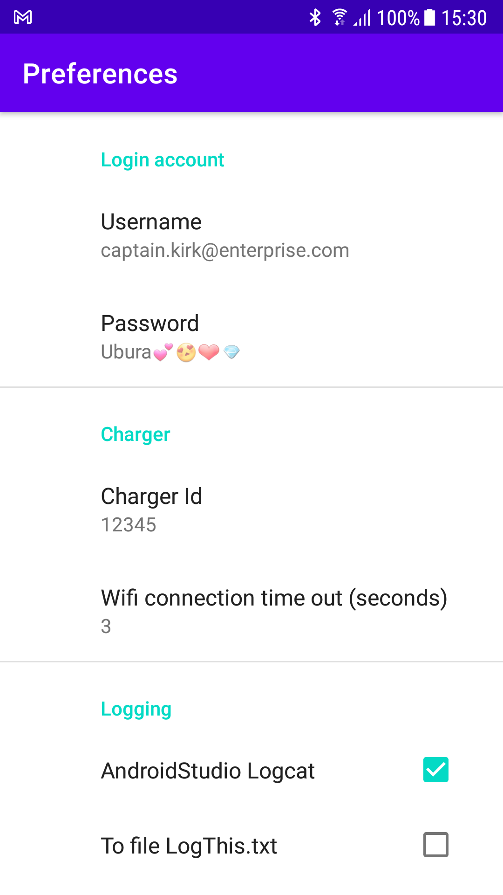
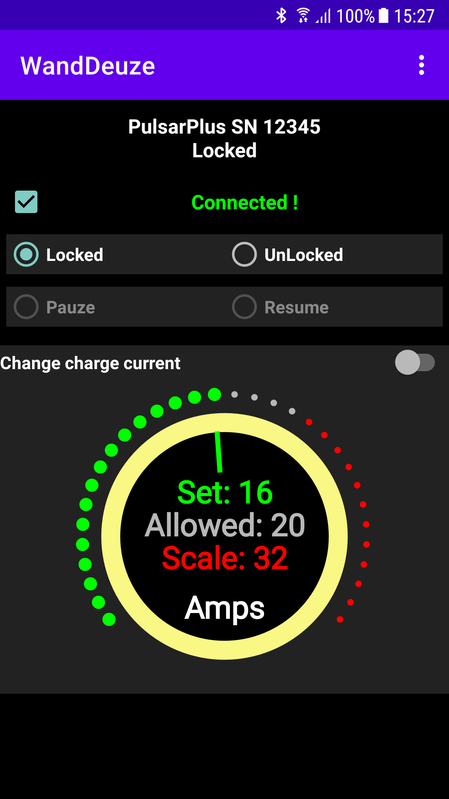
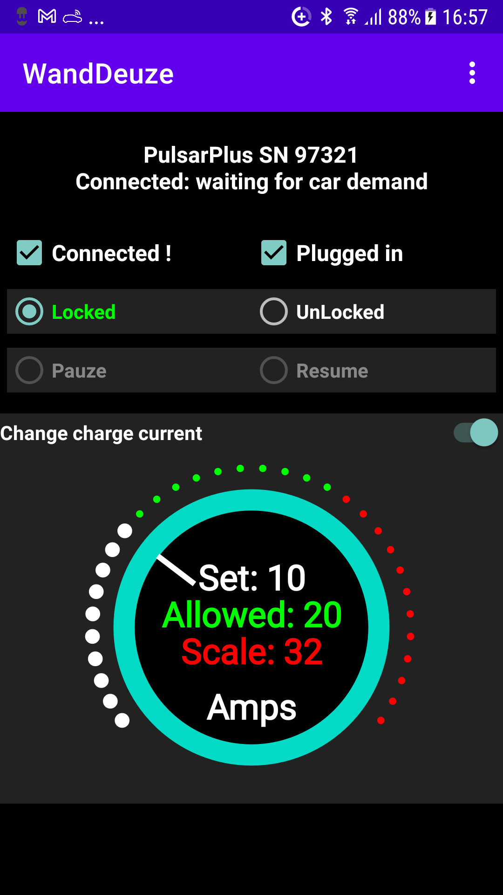

# WandDeuze
Android app WandDeuze communicates with your "Wallbox (Pulsar (Plus))" via Wifi only.

It does not use Bluetooth.
It may communicate with other Wallbox devices but I have only a Pulsar Plus to test it with.
You could also just use the Wallbox app but refuse Location access which then disables Bluetooth.
WandDeuze does only 4 simple things what the Wallbox app also does:
- display the status of the wallbox
- display if a connection with the wallbox is established, and if the cable is plugged in.
- lock or unlock the wallbox
- pauze or resume the charge session
- display and adjust the charging currrent

These are the very basic things needed to use the wallbox, more capabilities are not needed.
Multi language support is present: Nederlands, English, Français, Deutsch, Norge, Español, Svenska.

WandDeuze is my interpretation in dialect (German-NederSaksisch) for the words wall (wand) and box (deuze).
The app is based on some scripts that I found on the internet in Python and HomeyScript.
The sourcecode for the app is available on GIT:

The labels "Locked", "Unlocked", "Pauze", "Resume" and "Change charge current" can have one of the next colors:
- white, available option or reported by wallbox as current state
- gray, currently not allowed option
- green, change confirmed by the wallbox
- red, change not confirmed by the wallbox

That is ALL ! Warning: screenshots are from the first version.

  

https://www.youtube.com/watch?v=NtlvPnDq5qw

Sources:

 https://pypi.org/project/wallbox/#files
 
 https://community.homey.app/t/wallbox-pulsar-plus-charger-lock-unlock-pause-resume/54616
 
 https://github.com/harjot-oberai/Croller with some modifications

Icon:

 https://iconmonstr.com/car-7-png/

Some replies from the WallBox with attributes are (per line):
attribute status_id or status, attribute status_description, (derived) is cable plugged in
-   0, "NOT Connected to my.wallbox.com . Power Off-On (fuse) the wallbox.", unknown thus no
- 161, "Ready", no
- 179, "Connected: waiting for next schedule", yes
- 180, "Connected: waiting for car demand", yes
- 181, "Connected: waiting for car demand", yes
- 182, "Paused by user", yes
- 185, "Connected, PowerBoost reports: NOT ENOUGH POWER AVAILABLE to start charging", yes
- 194, "Charging", yes
- 209, "Locked", no
- 210, "waiting_to_unlock", yes

Note: since approx. 2022-03-20 the status_description attribute is no longer present in

# Searching in logged data for the added energy, in kWh.

The analysis of some logged data resulted in some quick findings as listed here.
The analysis are **based on a home situation with just 1 PHEV, charger and user.**
Findings are not complete, could be wrong and may change at any time.
More data is needed to confirm/complete the findings but that take time (wrt month transitions).
To investigate: lastSync and last_sync

## Charger Lock/Unlock and monthly energy status.
   
When with each charge session an unlock/lock is used then the response message on the unlock/lock control contains
the cumulative monthly charger data of all finished calendar days in 'data.chargerdata' object 'resume' .
A charger session during the month transition is the new month's 1st charger data.
Note that any finished session during a calendar day is not visible in this data until the day ends at 24:00:00.
Its possible to keep the charger unlocked for as long as you wish (home situation). In that case its response message is never received... so no data.

Example in JSON:
"resume":{"totalUsers":1,"totalSessions":12,"chargingTime":"185903","totalEnergy":"86513","totalMidEnergy":"0","energyUnit":"kWh"}

|JSON|Description|
|---|---|
| "totalUsers":1,          | number > 0 , number of different charger users. @Home there maybe only 1 user.|
| "totalSessions":12,      | number >= 0 , The total number of charging sessions of this charger.|
| "chargingTime":"185903", | string with a number >= 0, can be 'null', the total charging time in seconds.|
| "totalEnergy":"86513",   | string with a number >= 0, the sum of added energy on a dayly base, **in mkWh (milli kWh)**.|
| "totalMidEnergy":"0",    | string with a number >= 0, what is this ??|
| "energyUnit":"kWh"       | unit|

Example of the monthly charger data that is reset at the 1ste of each month:
"resume":{"totalUsers":1,"totalSessions":0,"chargingTime":null,"totalEnergy":0,"totalMidEnergy":0,"energyUnit":"kWh"}

## The charger status request with dayly energy status.

It seems to be the today's sum of charging data for a specific user (and EV ?).
In the stated home situation this is not a problem.

Example ij JSON of some fields wrt energy:
"added_range":70,"added_energy":8.438,"added_green_energy":0,"added_discharged_energy":0,"charging_time":82936

|JSON|Description|
|---|---|
| "added_range":70,            | number > = 0 , seems to be a percentage but of what.|
| "added_energy":8.438,        | decimal in kWh, sum added energy on this day or session ...??????|
| "added_green_energy":0,      | unknown|
| "added_discharged_energy":0, | unknown|
| "charging_time":82936        | number >= 0, the total charging time in seconds.|

Values are at least influenced by sequences of: cable plugged in/not, charger lock/unlock, charging yes/no and the month/day transition.
The values increase during charging every ~30 seconds.
A charger session during the day transition is the new day's 1st data. Thus during a month transition its the new month's 1st data.
When the data is added to the monthly values the today's values are adjusted accordingly.
