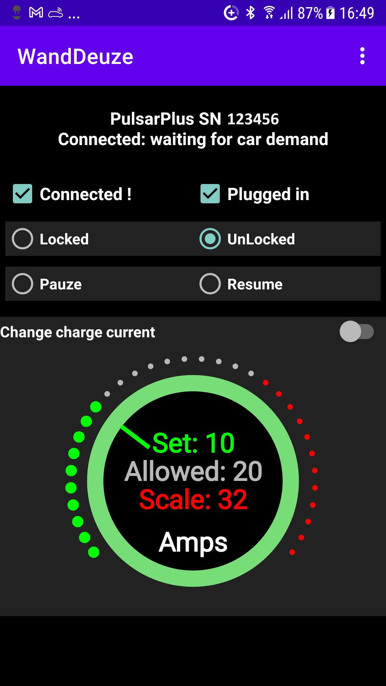

# WandDeuze
Android app WandDeuze communicates with your "Wallbox (Pulsar (Plus))" via Wifi only.

It does not use Bluetooth.
It may communicate with other Wallbox devices but I have only a Pulsar Plus to test it with.
You could also just use the Wallbox app but refuse Location access which then disables Bluetooth.
WandDeuze does only 4 simple things what the Wallbox app also does:
- display the status of the wallbox
- lock or unlock the wallbox
- pauze or resume the charge session
- display and adjust the charging currrent

These are the very basic things needed to use the wallbox, more capabilities are not needed.

WandDeuze is my interpretation in dialect (German-NederSaksisch) for the words wall (wand) and box (deuze).
The app is based on some scripts that I found on the internet in Python and HomeyScript.
The sourcecode for the app is available on GIT:

The labels "Connected", ""Locked, "Unlocked", "Pauze", "Resume" and "Change charge current" can have one of the next colors:
- white, available option or reported by wallbox as current state
- gray, currently not allowed option
- green, change confirmed by the wallbox
- red, change not confirmed by the wallbox

That is ALL !

  

https://www.youtube.com/watch?v=NtlvPnDq5qw

Sources:

 https://pypi.org/project/wallbox/#files
 
 https://community.homey.app/t/wallbox-pulsar-plus-charger-lock-unlock-pause-resume/54616
 
 https://github.com/harjot-oberai/Croller with some modifications

Icon:

 https://iconmonstr.com/car-7-png/

Attribute number from status_id or status, "status_description",  is PluggedIn
- 161, "Rady", no
- 179,"Connected: waiting for next schedule", yes
- 181,"Connected: waiting for car demand", yes
- 182,"Paused by user", yes
- 194, "Charging", yes
- 209, "Locked", no
- 210, "waiting_to_unlock", yes
